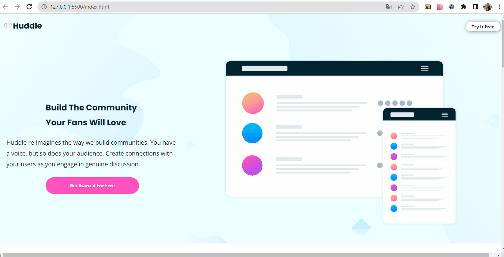

# Projeto Huddle Landing Page

## Descrição
    Projeto realizado com colaborção com o objetivo de treinar gerenciamento de tempo, git/gitHub, trabalho em equipe, mobile first e as demais hardskills citadas abaixo.

## Meu Processo

    •	Marcação semântica HTML5
    •	Propriedades personalizadas de CSS3
    •	Flexbox  
    •	Mobile First

## Design

### Desktop e Responsivo

## Autor

 GitHub: <a href="https://github.com/devkarine">DevKarine</a>  
FrontEndMentor: <a href="https://www.frontendmentor.io/profile/devkarine">@devkarine</a>  
CodePen: <a href="https://codepen.io/devkarine">DevKarine</a>  
LinkedIn: <a href="https://www.linkedin.com/in/devkarine/">Karine Pereira</a>

## Colab

GitHub: <a href="https://github.com/vieira-a">Anderson Vieira</a> 